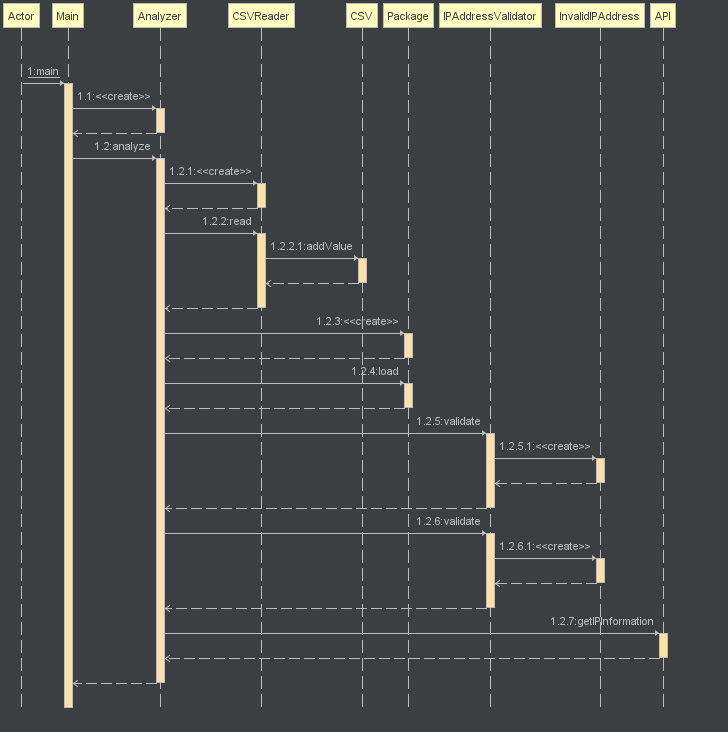
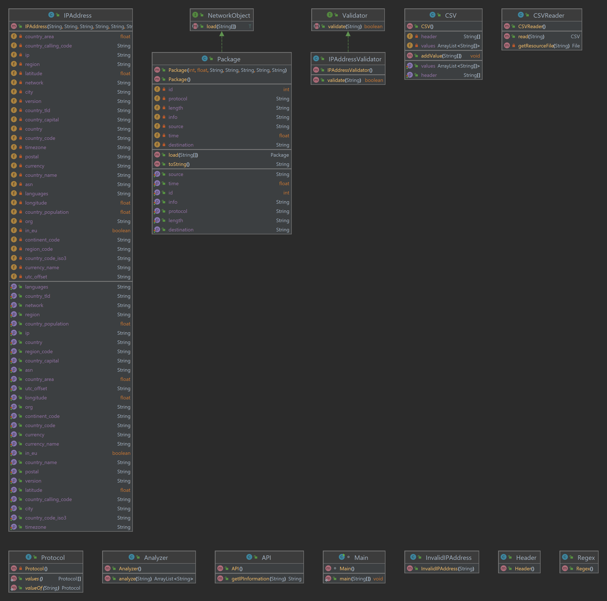

# PackageRadar

PackageRadar is a analyzing tool for Network Package Captures

## How to use this

1. Start the main function located in `PackageRadar/src/main/java/com/cryxnet/Main.java`
2. Select an Menu Item

## Sequence Diagram

## UML Diagram

